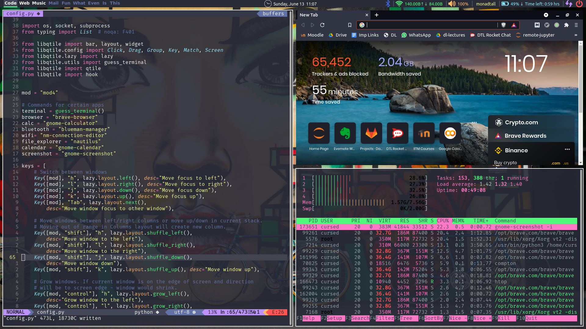
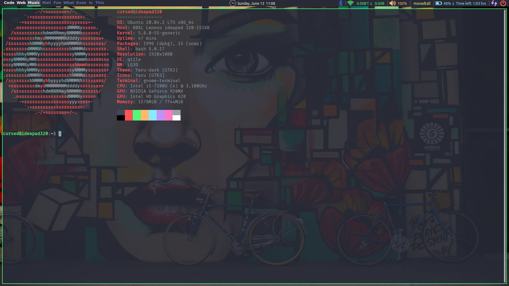
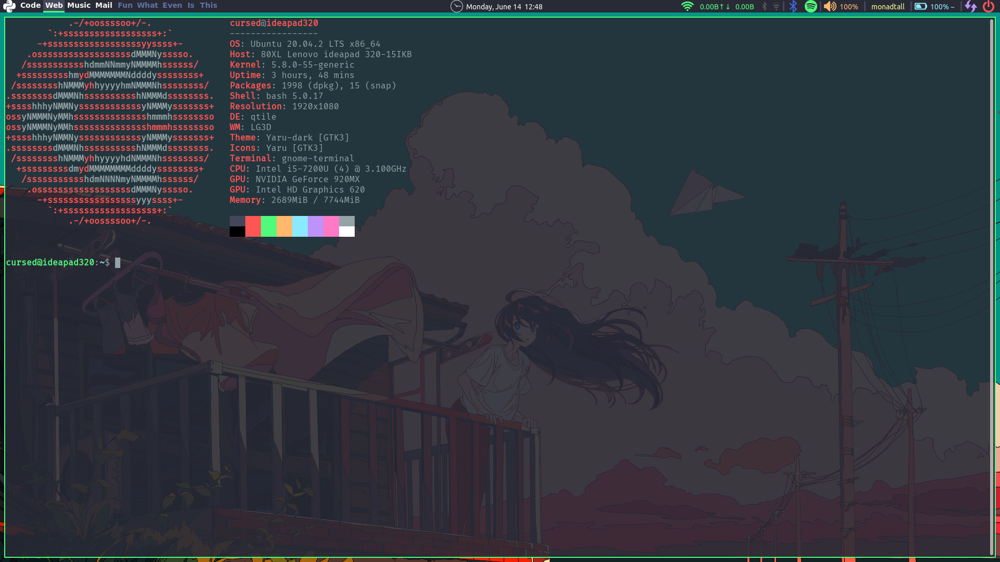

This repo contains my full Linux setup to supercharge my workflow. The configs included are as follows.
--------------------------------------------------------------------------------------------------------------------------------

1. Neovim setup
2. Qtile WM setup
3. Compton configuration
4. gtk 3/4 defaults
5. bashrc

Here are some juicy screenshots

